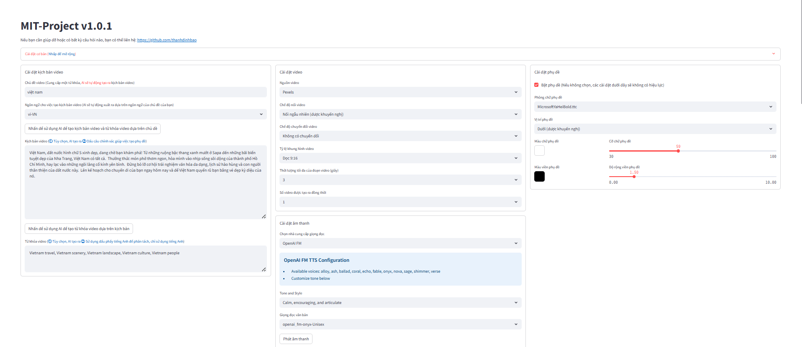
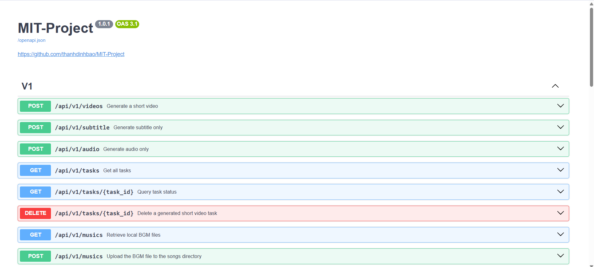

<div align="center">
<h1 align="center">MIT-Project 💸</h1>


Chỉ cần cung cấp <b>chủ đề</b> hoặc <b>từ khóa</b> cho video và công cụ sẽ tự động tạo bản sao video,
tài liệu video, phụ đề video và nhạc nền video trước khi tổng hợp thành video ngắn có độ phân giải cao.

### WebUI



### API Interface



</div>

## Features 🎯

- [x] Complete **MVC architecture**, **clearly structured** code, easy to maintain, supports both `API`
  and `Web interface`
- [x] Hỗ trợ bản sao video **do AI tạo** cũng như bản sao **tùy chỉnh**
- [x] Hỗ trợ nhiều kích cỡ **video độ nét cao**
    - [x] Chân dung 9:16, `1080x1920`
    - [x] Phong cảnh 16:9, `1920x1080`
- [x] Hỗ trợ **tạo video hàng loạt**, cho phép tạo nhiều video cùng lúc, sau đó chọn video
ưng ý nhất
- [x] Hỗ trợ thiết lập **thời lượng của các đoạn video**, tạo điều kiện thuận lợi cho việc điều chỉnh tần suất chuyển đổi vật liệu
- [x] Hỗ trợ sao chép video bằng cả **Tiếng Việt** và **Tiếng Anh**
- [x] Hỗ trợ tổng hợp **nhiều giọng nói**
- [x] Hỗ trợ **tạo phụ đề**, với `font`, `position`, `color`, `size` có thể điều chỉnh và cũng
hỗ trợ `phác thảo phụ đề`
- [x] Hỗ trợ **nhạc nền**, có thể là tệp nhạc ngẫu nhiên hoặc được chỉ định, với `âm lượng nhạc nền` có thể điều chỉnh
- [x] Nguồn tài liệu video có **độ phân giải cao** và **miễn phí bản quyền**
- [x] Hỗ trợ tích hợp với nhiều mô hình khác nhau như **OpenAI**, **moonshot**, **Azure**, **gpt4free**, **one-api**,
**qianwen**, **Google Gemini**, **Ollama** và nhiều mô hình khác

### Dự định tương lai 📅

- [ ] Giới thiệu hỗ trợ cho lồng tiếng GPT-SoVITS
- [ ] Nâng cao khả năng tổng hợp giọng nói với các mô hình lớn để có đầu ra giọng nói tự nhiên và truyền cảm hơn
- [ ] Kết hợp các hiệu ứng chuyển tiếp video để đảm bảo trải nghiệm xem mượt mà hơn
- [ ] Cải thiện mức độ liên quan của nội dung video
- [ ] Thêm tùy chọn cho độ dài video: ngắn, trung bình, dài
- [ ] Đóng gói ứng dụng thành một gói khởi chạy một cú nhấp chuột cho Windows và macOS để dễ sử dụng
- [ ] Cho phép sử dụng các tài liệu tùy chỉnh
- [ ] Cung cấp các tùy chọn lồng tiếng và nhạc nền với bản xem trước theo thời gian thực
- [ ] Hỗ trợ nhiều nhà cung cấp tổng hợp giọng nói hơn, chẳng hạn như OpenAI TTS, Azure TTS
- [ ] Tự động hóa quy trình tải lên nền tảng TikTok

## Video Demos 📺

### Chân dung 9:16

<table>
<thead>
<tr>
<th align="center"><g-emoji class="g-emoji" alias="arrow_forward">▶️</g-emoji> How to Add Fun to Your Life </th>
<th align="center"><g-emoji class="g-emoji" alias="arrow_forward">▶️</g-emoji> What is the Meaning of Life</th>
</tr>
</thead>
<tbody>
<tr>
<td align="center"><video src="https://github.com/thanhdinhbao/MIT-Project/assets/4928832/a84d33d5-27a2-4aba-8fd0-9fb2bd91c6a6"></video></td>
<td align="center"><video src="https://github.com/thanhdinhbao/MIT-Project/assets/4928832/112c9564-d52b-4472-99ad-970b75f66476"></video></td>
</tr>
</tbody>
</table>

### Phong cảnh 16:9

<table>
<thead>
<tr>
<th align="center"><g-emoji class="g-emoji" alias="arrow_forward">▶️</g-emoji> What is the Meaning of Life</th>
<th align="center"><g-emoji class="g-emoji" alias="arrow_forward">▶️</g-emoji> Why Exercise</th>
</tr>
</thead>
<tbody>
<tr>
<td align="center"><video src="https://github.com/thanhdinhbao/MIT-Project/assets/4928832/346ebb15-c55f-47a9-a653-114f08bb8073"></video></td>
<td align="center"><video src="https://github.com/thanhdinhbao/MIT-Project/assets/4928832/271f2fae-8283-44a0-8aa0-0ed8f9a6fa87"></video></td>
</tr>
</tbody>
</table>

## Yêu cầu hệ thống 📦

- Khuyến nghị tối thiểu 4 nhân CPU trở lên, bộ nhớ 8G trở lên, không yêu cầu GPU
- Windows 10 hoặc MacOS 11.0 và các phiên bản mới hơn

## Cài đặt & Triển khai 📥
- Đảm bảo **mạng** của bạn ổn định

#### ① Clone dự án

```shell
git clone https://github.com/thanhdinhbao/MIT-Project.git
```

#### ② Sửa đổi tập tin cấu hình

- Sao chép tệp `config.example.toml` và đổi tên thành `config.toml`
- Làm theo hướng dẫn trong tệp `config.toml` để cấu hình `pexels_api_keys` và `llm_provider`, và theo
nhà cung cấp dịch vụ llm_provider, hãy thiết lập Khóa API tương ứng

#### ③ Cấu hình Large Language Models (LLM)

- Để sử dụng `GPT-4.0` hoặc `GPT-3.5`, bạn cần `API Key` từ `OpenAI`. Nếu bạn không có, bạn có thể đặt `llm_provider`
thành `g4f` (thư viện GPT miễn phí https://github.com/xtekky/gpt4free)


### Triển khai thủ công 📦

#### ① Tạo môi trường ảo Python

Nên tạo môi trường ảo Python để tránh xung đột phụ thuộc.

```bash
# Clone the project
git clone https://github.com/thanhdinhbao/MIT-Project.git
cd MIT-Project

# Create virtual environment
python -m venv venv

# Activate virtual environment
# On Windows:
venv\Scripts\activate
# On macOS/Linux:
source venv/bin/activate

# Install dependencies
pip install -r requirements.txt

```

###### Windows

```bat
conda activate MIT-Project
webui.bat
```

###### MacOS or Linux

```shell
conda activate MIT-Project
sh webui.sh
```

Sau khi khởi chạy, trình duyệt sẽ tự động mở

#### ② Truy cập giao diện web

Mở trình duyệt của bạn và truy cập http://0.0.0.0:8501

#### ③ Truy cập giao diện API

Mở trình duyệt của bạn và truy cập http://0.0.0.0:8080/docs Hoặc http://0.0.0.0:8080/redoc

#### ④ Khởi chạy dịch vụ API 🚀

```shell
python main.py
```

Sau khi khởi chạy, bạn có thể xem `Tài liệu API` tại http://127.0.0.1:8080/docs và trực tiếp kiểm tra giao diện
trực tuyến để có trải nghiệm nhanh chóng.
## Tạo phụ đề 📜

Hiện tại, có 2 cách để tạo phụ đề:

- edge: Tốc độ tạo nhanh hơn, hiệu suất tốt hơn, không có yêu cầu cụ thể về cấu hình máy tính, nhưng
chất lượng có thể không ổn định
- whisper: Tốc độ tạo chậm hơn, hiệu suất kém hơn, yêu cầu cụ thể về cấu hình máy tính, nhưng
chất lượng đáng tin cậy hơn

Bạn có thể chuyển đổi giữa chúng bằng cách sửa đổi `subtitle_provider` trong tệp cấu hình `config.toml`

Bạn nên sử dụng chế độ `edge` và chuyển sang chế độ `whisper` nếu chất lượng phụ đề được tạo không
đạt yêu cầu.

> Note:
> Nếu để trống, điều đó có nghĩa là sẽ không có phụ đề nào được tạo ra.

**Tải whisper**
- Hãy đảm bảo kết nối internet tốt
- Có thể tải mô hình `whisper` từ HuggingFace: https://huggingface.co/openai/whisper-large-v3/tree/main

Sau khi tải mô hình xuống máy cục bộ, hãy sao chép toàn bộ thư mục và đặt vào đường dẫn sau: `.\MIT-Project\models`

Đường dẫn cuối cùng sẽ trông như thế này: `.\MIT-Project\models\whisper-large-v3`

```
MIT-Project  
  ├─models
  │   └─whisper-large-v3
  │          config.json
  │          model.bin
  │          preprocessor_config.json
  │          tokenizer.json
  │          vocabulary.json
```

## Nhạc nền 🎵

Nhạc nền cho video nằm trong thư mục `resource/songs` của dự án.
> Dự án hiện tại bao gồm một số nhạc mặc định từ video YouTube. Nếu có vấn đề về bản quyền, vui lòng xóa
> chúng.

## Phông chữ phụ đề 🅰

Phông chữ để hiển thị phụ đề video nằm trong thư mục `resource/fonts` của dự án và bạn cũng có thể thêm phông chữ của riêng mình.

## Câu hỏi thường gặp 🤔

### ❓Làm thế nào để sử dụng mô hình OpenAI GPT-3.5 miễn phí?

[OpenAI đã thông báo rằng ChatGPT với 3.5 hiện đã miễn phí](https://openai.com/blog/start-using-chatgpt-instantly), và
các nhà phát triển đã gói nó vào một API để sử dụng trực tiếp.

**Đảm bảo bạn đã cài đặt và chạy Docker**. Thực hiện lệnh sau để khởi động dịch vụ Docker:

```shell
docker run -p 3040:3040 missuo/freegpt35
```

Sau khi khởi động thành công, hãy sửa đổi cấu hình `config.toml` như sau:

- Đặt `llm_provider` thành `openai`
- Điền bất kỳ giá trị nào vào `openai_api_key`, ví dụ: '123456'
- Đổi `openai_base_url` thành `http://localhost:3040/v1/`
- Đặt `openai_model_name` thành `gpt-3.5-turbo`

### ❓RuntimeError: Không tìm thấy ffmpeg exe

Thông thường, ffmpeg sẽ được tự động tải xuống và phát hiện. 
Tuy nhiên, nếu môi trường của bạn có vấn đề ngăn chặn việc tải xuống tự động, bạn có thể gặp phải lỗi sau:

```
RuntimeError: No ffmpeg exe could be found.
Install ffmpeg on your system, or set the IMAGEIO_FFMPEG_EXE environment variable.
```

Trong trường hợp này, bạn có thể tải xuống ffmpeg từ https://www.gyan.dev/ffmpeg/builds/, giải nén và đặt `ffmpeg_path` thành
đường dẫn cài đặt thực tế của bạn.

```toml
[app]
# Please set according to your actual path, note that Windows path separators are \\
ffmpeg_path = "C:\\Users\\thanh\\Downloads\\ffmpeg.exe"
```


